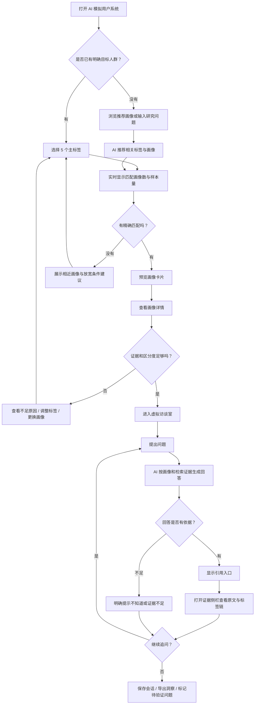

# 射击品类 AI 模拟用户：用户流程与场景说明

> 版本：v1.0  
> 日期：2026-07-27  
> 产品范围：群体画像检索与虚拟访谈  
> 核心用户：用研经理、游戏策划

## 1. 产品目标

帮助业务人员在正式招募和真实研究之前，快速利用历史访谈语料完成：

- 目标玩家探索。
- 产品概念和玩法方向预筛。
- 访谈提纲预演。
- 已有用户洞察复用。
- 画像差异比较。
- 有证据的模拟深访。

产品不是用 AI 替代真实用户研究，而是用于“形成假设、发现问题、缩小方案范围和复用已有证据”。涉及立项决策、重大商业化决策或代表性结论时，仍需真实用户验证。

## 2. 核心用户

## 2.1 用研经理

### 目标

- 快速找到与研究问题相关的典型玩家。
- 在正式访谈前验证提纲是否能问出有效信息。
- 从历史资料中找回可复用证据。
- 识别未知点和需要补招募的人群。

### 痛点

- 历史笔录量大、检索困难。
- 面对陌生品类时，不知道先问什么。
- 研究周期慢，难以响应快速迭代。
- 单份报告压缩了玩家差异，原声难追溯。

## 2.2 游戏策划

### 目标

- 快速预判不同玩家对玩法方案的反应。
- 比较两个设计方向的吸引点和风险。
- 理解玩家反应背后的动机，不只看“喜欢/不喜欢”。
- 找到需要进一步验证的争议点。

### 痛点

- 需求变化快，无法为每个小问题都启动正式研究。
- 容易只听到核心玩家或身边同事的声音。
- 得到结论后仍不清楚“为什么”。
- 方案讨论缺少可引用的真实语料。

## 3. 典型场景

## 3.1 场景 A：立项概念预筛

**使用者**：游戏策划、产品经理  
**触发**：团队有 2–4 个立项概念，需要在正式调研前缩小范围。  
**流程**：

1. 选择目标玩家标签，例如“手游 + PVE 为主 + 社交归属 + 时间受限”。
2. 查看匹配画像、样本量和标签证据。
3. 对多个画像分别提出同一概念问题。
4. 比较兴趣、顾虑、迁移条件和拒绝原因。
5. 导出“支持点—风险点—待验证问题”。

**成功结果**：淘汰明显不匹配的概念，并形成真实调研假设。  
**不能替代**：市场规模判断、定量偏好比例和最终立项决策。

## 3.2 场景 B：玩法机制比较

**使用者**：系统/战斗策划  
**触发**：需要比较 TTK、复活机制、地图、技能或武器方案。  
**流程**：

1. 选定能力、风格和模式差异明显的 2–3 个画像。
2. 使用统一问题分别访谈。
3. 追问“为什么”“什么情况下会改变选择”。
4. 查看回答引用的原始语料和标签链。
5. 记录群体共识与分歧。

**成功结果**：得到不同类型玩家的决策逻辑，而非单一平均答案。

## 3.3 场景 C：访谈提纲预演

**使用者**：用研经理  
**触发**：正式深访前需要检查问题是否清晰、是否存在诱导。  
**流程**：

1. 选择与招募条件相近的画像。
2. 按拟定提纲进行 10–15 分钟模拟访谈。
3. 标记回答空泛、超出画像知识或无法区分画像的问题。
4. 查看系统给出的“建议追问”和“证据不足”提示。
5. 修改提纲，再次验证。

**成功结果**：减少无效问题，提前发现需要追问的动机层。

## 3.4 场景 D：历史洞察复用

**使用者**：用研经理、策划  
**触发**：出现新需求，但怀疑历史研究中已有相关信息。  
**流程**：

1. 用标签和自然语言问题检索画像。
2. 进入画像详情查看代表性原声。
3. 与画像对话补充解释。
4. 打开证据侧栏，查看原始片段、来源研究和上下文。
5. 收藏或导出证据。

**成功结果**：明确哪些结论已有证据、哪些仍需新研究。

## 3.5 场景 E：画像质量审核

**使用者**：用研专家  
**触发**：AI 完成打标或聚类，需要判断画像是否真实、稳定、可区分。  
**流程**：

1. 查看画像标签、样本量和置信度。
2. 检查 M1→M5 心智链。
3. 抽阅中心样本、反例和边界样本。
4. 使用一致性题进行多轮对话。
5. 标记通过、需修改、拆分、合并或废弃。

**成功结果**：每个上线画像都有清晰区分和足够证据。

## 4. 主流程图

## 5. 关键页面与操作

## 5.1 首页

用户需要看到：

- 产品能做什么、不能做什么。
- “按标签找画像”和“从研究问题开始”两个入口。
- 最近使用的画像和会话。
- 数据版本、更新时间和适用范围。

人工操作：

- 选择入口、输入研究问题。

AI 自动：

- 从自然语言研究问题中建议标签，但不自动确认。

## 5.2 标签选择器

用户操作：

- 选择诉求、能力、风格、平台和模式。
- 展开更多筛选。
- 清空、撤销或保存组合。

系统反馈：

- 匹配画像数、样本量和置信度。
- 冲突标签禁用及原因。
- 最近一次选择带来的匹配变化。
- 无结果时提供放宽建议。

## 5.3 画像列表

每张卡片至少显示：

- 画像名称和一句话描述。
- 五个主标签。
- 样本量和画像置信度。
- 主要动机链摘要。
- 与当前筛选条件的匹配度。
- “查看详情”和“开始访谈”。

禁止只显示拟人化名称而没有样本量和证据状态。

## 5.4 画像详情

至少包含：

- 客观属性概览，但不虚构具体身份。
- 主标签和扩展标签。
- M1→M5 动机链。
- 3–5 条代表性原声。
- 反例/边界样本。
- 数据来源、覆盖时间和样本量。
- 已知边界与不可回答范围。

## 5.5 虚拟访谈室

至少包含：

- 当前画像固定信息卡。
- 多轮对话。
- AI 思考/生成状态。
- 每条回答的证据入口。
- “回答依据不足”提示。
- 建议追问，但用户决定是否采用。
- 保存、复制和导出。

## 5.6 证据侧栏

每条证据显示：

- 原始文本。
- 来源文件/研究项目。
- 受访者匿名 ID。
- 片段上下文。
- M1–M5 和枪战框架标签。
- 证据等级与置信度。
- 是否为直引、概括或推断。

## 6. AI 自动与人工边界

| 环节 | AI 自动完成 | 人工负责 |
|---|---|---|
| 标签建议 | 从问题和语料建议标签 | 确认研究目标和最终筛选 |
| 语料标注 | 批量生成候选标签与置信度 | 审核低置信、冲突和黄金案例 |
| 画像聚类 | 计算相似度、生成候选聚类 | 判断是否是真实人群，拆分/合并 |
| 画像命名 | 生成候选名称和摘要 | 避免污名化、确认业务可读性 |
| 对话回答 | 按画像和证据生成回答 | 判断是否足以支持业务结论 |
| 证据检索 | 返回相似片段和来源 | 判断证据质量和适用边界 |
| 洞察总结 | 汇总共识、分歧和待验证项 | 形成研究结论和决策建议 |
| 产品决策 | 不自动作最终决策 | 业务负责人结合真实研究决定 |

核心原则：

- AI 可以“建议、归纳、模拟”，不能把推断包装成事实。
- 画像没有证据时必须说“不知道/现有材料不足”。
- 系统不得虚构具体城市、职业、收入、游戏经历或真实事件。
- 任何输出都应允许用户追溯到来源。

## 7. 异常路径

## 7.1 标签组合无匹配

系统：

- 不显示空白页。
- 明确指出冲突或限制最大的条件。
- 给出最多 3 个相近画像。
- 允许一键放宽单个条件。

用户：

- 调整标签，或记录为“数据空白人群”。

## 7.2 匹配样本过少

阈值建议：

- `<10` 条证据：高风险，不推荐用于画像对话。
- `10–29` 条：探索性使用，显著提示低样本。
- `≥30` 条：可进入正常预览，但仍需看来源多样性。

系统不得用生成内容掩盖低样本问题。

## 7.3 问题超出知识边界

例如询问画像从未涉及的新游戏、具体收入或个人经历。

AI 应：

1. 说明画像材料中没有直接证据。
2. 若可类比，明确标注为“基于已有偏好的推测”。
3. 给出置信度或建议用户改问。

## 7.4 证据互相矛盾

系统：

- 同时展示双方证据。
- 标记可能的时间、产品或情境差异。
- 不强行输出唯一答案。

## 7.5 SSE/网络中断

- 保留用户已输入的问题。
- 显示可重试状态。
- 重试时避免重复生成和重复保存。
- 已返回的引用证据不丢失。

## 7.6 会话刷新或丢失

- `sessionId` 持久化到 URL 或本地状态。
- 刷新后自动恢复历史。
- 恢复失败时提供“重新载入/导出已缓存内容”。

## 7.7 敏感或不当问题

- 不基于性别、地域、收入等生成歧视性结论。
- 不泄露原始受访者可识别信息。
- 对涉及现实个人身份的问题提示系统仅代表群体画像。

## 8. 研究问题模式

除按标签选择外，建议提供“从问题开始”：

1. 用户输入：“我们想做一款三人合作 PVE 射击手游，谁会感兴趣？”
2. AI 解析为候选条件：手机、PVE、团队协作/社交归属。
3. 系统展示解析结果，等待用户确认。
4. 用户可修改后执行匹配。

注意：AI 解析只产生候选筛选条件，不能静默替用户确定目标人群。

## 9. 结果导出

一次完整会话可导出：

- 研究问题。
- 选用画像与标签。
- 样本量和置信度。
- 对话摘要。
- 关键共识和分歧。
- 引用证据及来源。
- 推断项和证据不足项。
- 建议进入真实研究验证的问题。

导出标题应包含标签体系版本、画像版本和数据更新时间。

## 10. 验收标准

### 主流程

- 用户可在 3 分钟内从首页进入第一次画像对话。
- 标签选择后 500ms 内给出匹配反馈（不含首次网络冷启动）。
- 画像详情能够看到 M1–M5 和至少 3 条代表性证据。
- AI 回答可打开证据侧栏。
- 无证据问题不会生成伪造事实。

### 可理解性

- 首次使用者能解释五个主维度的差异。
- 互斥标签有明确原因，不只灰掉。
- “能力成长/竞技证明”“社交归属/团队合作”等易混标签提供说明。

### 可靠性

- 刷新后会话可恢复。
- 网络中断可重试且不重复保存。
- 低样本、低置信和冲突证据均有可见提示。
- 所有引用可以回到原始片段。

### 研究有效性

- 同一画像多轮回答保持核心标签一致。
- 不同画像在关键维度上有可解释差异。
- 回答遵循 M1→M5 动机链，而不是机械复述标签。
- 现有 122 道题均可进入对应评测流程。

## 11. 建议的 MVP 优先级

### P0

- 五维标签选择和互斥规则。
- 画像列表/详情。
- 证据溯源。
- 对话知识边界。
- 会话恢复和基本错误提示。

### P1

- 从研究问题推荐标签。
- 多画像对比访谈。
- 会话洞察导出。
- 低样本和冲突证据可视化。

### P2

- 用户自定义画像组合。
- 研究项目级权限与数据版本管理。
- 画像表现监控和自动评测看板。

